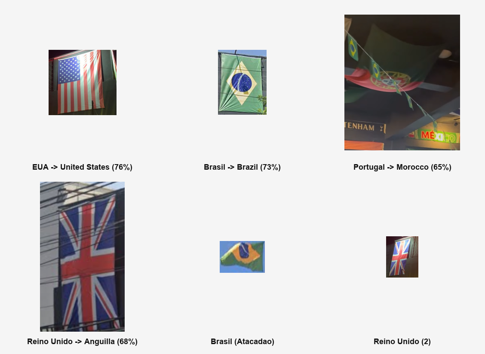

# 🏴 Detecção de Bandeiras de Países com YOLOv8

Projeto da disciplina de **Ciência de Dados — Projeto 3 (Deep Learning / YOLO)**.

Treinamento e avaliação de um modelo **YOLOv8** para detectar **86 bandeiras nacionais**
em imagens, com aplicação em fotos reais capturadas pelo grupo.

> 🎯 **Classe inédita:** "bandeira de país" **não** faz parte das 80 classes do dataset
> COCO sobre as quais o YOLO é pré-treinado — atendendo ao requisito do enunciado.

---

## 👥 Integrantes

- Pedro Pereira da Silva — matrícula 2013702
- Victor Rios Dantas — matrícula 2310350

---

## 📦 Conteúdo do repositório

| Arquivo | Descrição |
|---------|-----------|
| `YOLO_Bandeiras.ipynb` | Notebook principal (executado no Colab, com todas as saídas) |
| `limpar_dataset.py` | Script de limpeza/reindexação do dataset (pré-processamento) |
| `README.md` | Este arquivo |

---

## 📊 Dataset

| | |
|---|---|
| **Origem** | [Roboflow Universe — country-flags-2t33e (v4)](https://universe.roboflow.com/phamdata/country-flags-2t33e/dataset/4) |
| **Licença** | CC BY 4.0 |
| **Classes** | 86 bandeiras (após limpeza) |
| **Imagens** | 10.187 (treino: 8.940 · validação: 827 · teste: 420) |
| **Bounding boxes** | 10.033 (após limpeza) |

### ⬇️ Baixar o dataset já limpo (pronto pra usar)

O dataset limpo (`dataset_clean.zip`, ~203 MB) está disponível para download aqui:

**🔗 [Download do dataset_clean.zip (Google Drive)](https://drive.google.com/file/d/1lqiEDRVNBUGcbJjkeIpLFSUEYd9eKVp3/view?usp=sharing)**

> Esse zip já tem o `data.yaml` corrigido e as 86 classes reindexadas (0–85). Basta
> fazer o upload dele no Colab quando o notebook pedir.

### 🧹 Limpeza aplicada

As classes originais `0 (Afghanistan)` e `1 (Albania)` tinham anotações corrompidas.
O script `limpar_dataset.py`:

- Remove as bounding boxes dessas classes (167 caixas);
- Reindexa as 86 classes restantes (0–85);
- Atualiza o `data.yaml` (`nc: 88 → 86`);
- Gera uma cópia limpa **sem alterar o original**.

Para reproduzir a limpeza a partir do dataset bruto do Roboflow:

```bash
pip install pyyaml
python limpar_dataset.py   # ajuste os caminhos orig_base / clean_base no topo do script
```

---

## 🚀 Como executar

O notebook foi feito para rodar no **Google Colab** (com GPU).

1. **Abra o notebook no Colab:** `Arquivo → Abrir notebook → GitHub` e cole a URL deste
   repositório, ou faça upload de `YOLO_Bandeiras.ipynb`.

2. **Ative a GPU:** `Ambiente de execução → Alterar tipo de ambiente → GPU (T4)`.

3. **Execute as células na ordem.** Quando solicitado:
   - **Upload do dataset:** envie o `dataset_clean.zip` (link de download acima);
   - **Upload das fotos reais:** envie as fotos de bandeiras capturadas pelo grupo.

4. **Treinamento:** 60 épocas, `yolov8s.pt`, `imgsz=640`, `batch=16`.
   Se aparecer `CUDA out of memory`, reduza `batch` para `8`.

---

## 🧠 Modelo e hiperparâmetros

| Parâmetro | Valor |
|-----------|-------|
| Modelo base | `yolov8s.pt` (small, 11,2 M parâmetros) |
| Épocas | 60 |
| Resolução (`imgsz`) | 640 |
| Batch | 16 |
| Early stopping (`patience`) | 15 |

---

## 📈 Resultados

Métricas obtidas no **conjunto de teste** (420 imagens):

| Métrica | Valor |
|---------|-------|
| Precisão (Precision) | **0,9682** |
| Revocação (Recall) | **0,9642** |
| mAP@0.5 | **0,9844** |
| mAP@0.5:0.95 | **0,9742** |

### Resultados das predições — fotos reais (capturadas pelo grupo)

| Bandeira | Predição | Confiança | Resultado |
|----------|----------|-----------|-----------|
| Estados Unidos | United States | 76,2% | ✅ |
| Brasil | Brazil | 73,0% | ✅ |
| Reino Unido | Anguilla Flag | 68,5% | ❌ (classe ausente no dataset) |
| Portugal | Morocco | 65,1% | ❌ (foto distante / cores parecidas) |



*Fotos de bandeiras capturadas pelo próprio grupo, com o resultado da predição do modelo
indicado em cada uma.*

> O alto desempenho no teste (mAP@0.5 = 0,98) contrasta com os erros em fotos reais do
> Reino Unido e Portugal — efeito de **classe ausente** e **diferença de domínio**
> (domain gap) entre o dataset e as condições reais de captura.

> 📊 As **curvas de treinamento** e a **matriz de confusão** estão detalhadas no
> **relatório técnico (PDF)**.

---

## 📝 Licença

Dataset sob licença **CC BY 4.0** (Roboflow). Código deste repositório para fins
acadêmicos.
